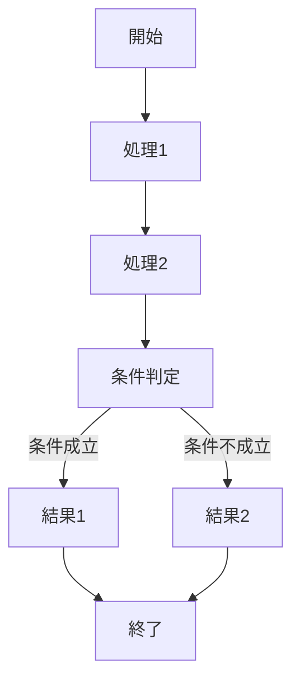
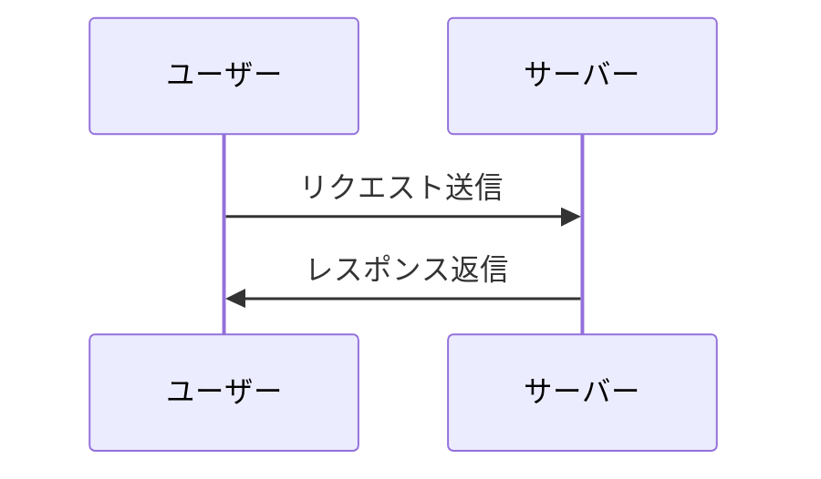
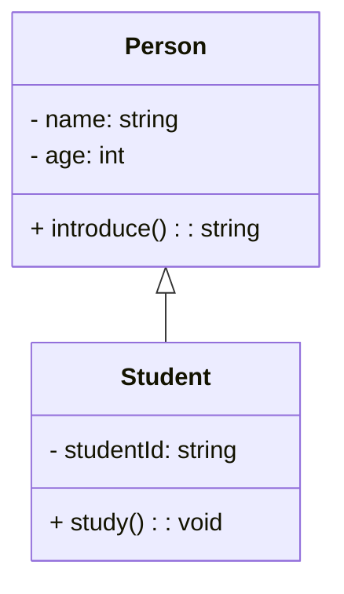

## mermaidで記述できるダイアグラムの記述例とコード

#### 1.フローチャート (Flowchart)

<!-- ```mermaid -->
##### コード
    graph TD;
        A[開始]-->B[処理1];
        B-->C[処理2];
        C-->D[条件判定];
        D-- 条件成立 -->E[結果1];
        D-- 条件不成立 -->F[結果2];
        E-->G[終了];
        F-->G;
<!-- ``` -->

#### 2.シーケンス図 (Sequence Diagram)

##### コード


    sequenceDiagram

        participant A as ユーザー
        participant B as サーバー

        A->>B: リクエスト送信
        B->>A: レスポンス返信

#### 3.クラス図 (Class Diagram)

##### コード

    classDiagram
        class Person {
          - name: string
          - age: int
          + introduce(): string
        }
        class Student {
          - studentId: string
          + study(): void
        }
        Person <|-- Student