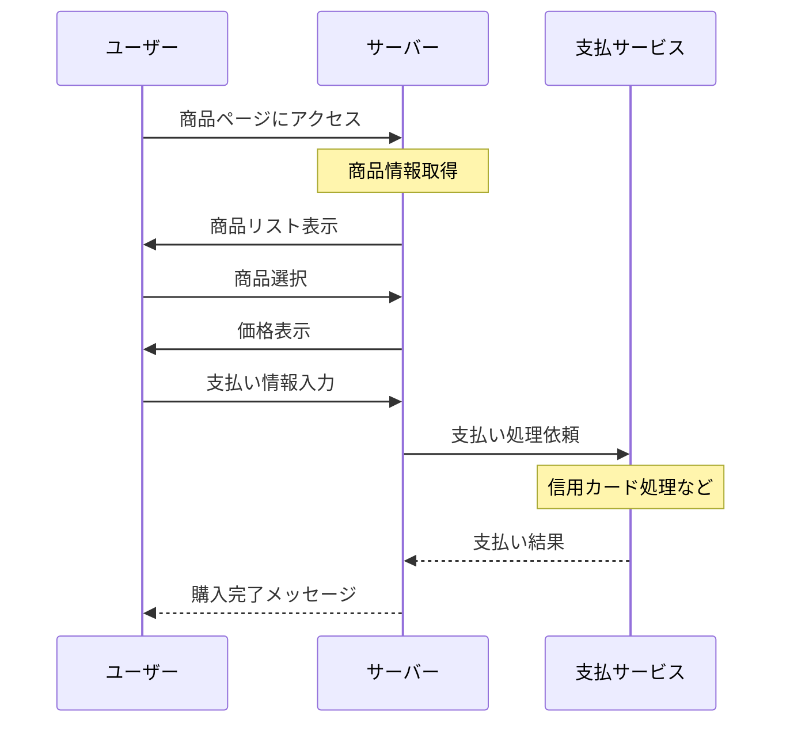

## シーケンス図の例：ユーザーが商品を購入するプロセス

```mermaid
sequenceDiagram
    participant ユーザー
    participant サーバー
    participant 支払サービス

    ユーザー->>サーバー: 商品ページにアクセス
    Note over サーバー: 商品情報取得
    サーバー->>ユーザー: 商品リスト表示
    ユーザー->>サーバー: 商品選択
    サーバー->>ユーザー: 価格表示
    ユーザー->>サーバー: 支払い情報入力
    サーバー->>支払サービス: 支払い処理依頼
    Note over 支払サービス: 信用カード処理など
    支払サービス-->>サーバー: 支払い結果
    サーバー-->>ユーザー: 購入完了メッセージ
```