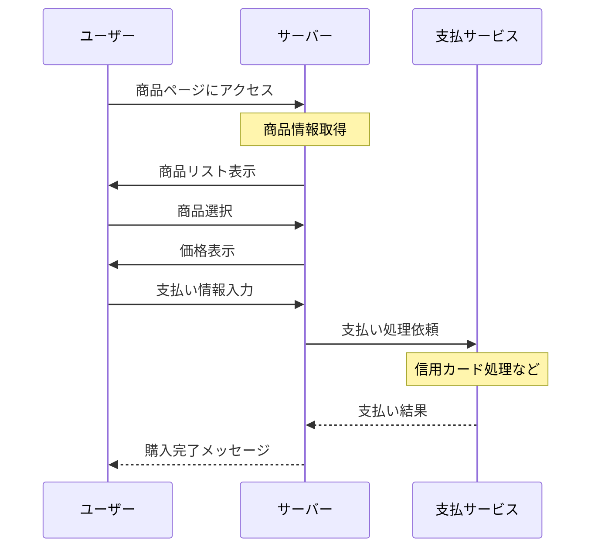

## シーケンス図の例：ユーザーが商品を購入するプロセス

#### コード
    sequenceDiagram
        participant ユーザー
        participant サーバー
        participant 支払サービス

        ユーザー->>サーバー: 商品ページにアクセス
        Note over サーバー: 商品情報取得
        サーバー->>ユーザー: 商品リスト表示
        ユーザー->>サーバー: 商品選択
        サーバー->>ユーザー: 価格表示
        ユーザー->>サーバー: 支払い情報入力
        サーバー->>支払サービス: 支払い処理依頼
        Note over 支払サービス: 信用カード処理など
        支払サービス-->>サーバー: 支払い結果
        サーバー-->>ユーザー: 購入完了メッセージ

#### チュートリアル
1.ユーザーアクセス: ユーザーが商品ページにアクセスします。

2.商品情報取得: サーバーは、ユーザーがアクセスした商品ページにおける商品情報を取得します。

3.商品リスト表示: サーバーは、取得した商品情報をもとに、ユーザーに商品リストを表示します。

4.商品選択: ユーザーは商品リストから欲しい商品を選択します。

5.価格表示: サーバーは、ユーザーが選択した商品の価格を表示します。

6.支払い情報入力: ユーザーは支払い情報を入力します。これには、クレジットカード情報や配送先などが含まれます。

7.支払い処理依頼: サーバーは、入力された支払い情報を支払いサービスに送信し、支払い処理を依頼します。

8.支払い処理: 支払いサービスは、受け取った支払い情報を処理します。例えば、信用カード処理などが行われます。

9.支払い結果: 支払いサービスは、支払いの結果をサーバーに返します。成功したかどうかの情報も含まれます。

10.購入完了メッセージ: サーバーは、支払いが成功した場合にはユーザーに購入完了のメッセージを表示します。